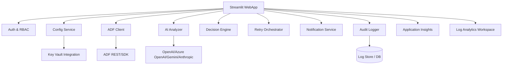
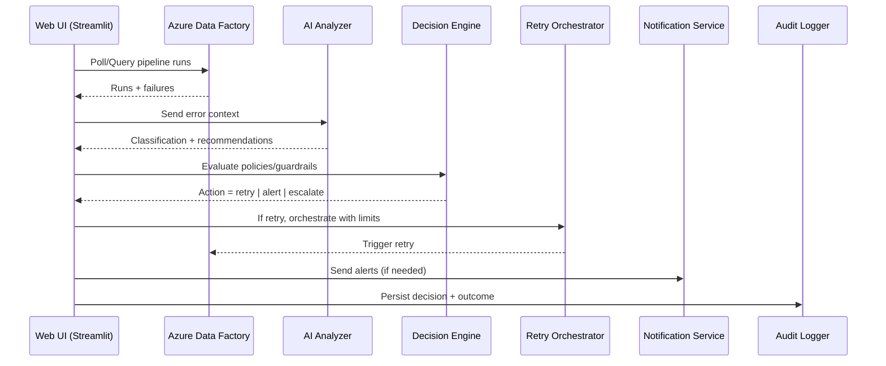
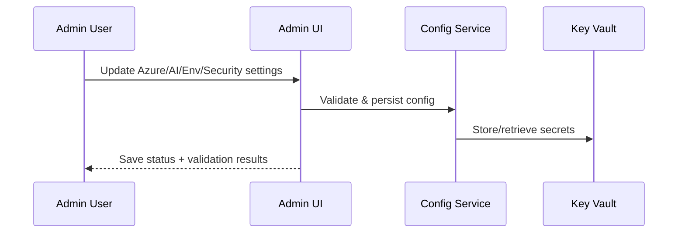

# ADF Monitor Pro — Architecture & Design

This document explains the system purpose, high-level and low-level architecture, data and process flows, Azure resources, and key operational concerns. Copy and adapt the Mermaid diagrams as needed.

## 1) Purpose & Scope
- Mission: Provide enterprise-grade monitoring, AI-assisted triage, and safe auto-recovery for Azure Data Factory (ADF) pipelines.
- Key outcomes: Faster incident response, fewer false alerts, consistent retries, and an auditable record of decisions.
- Primary users: Data engineers, platform engineers, SREs, and analytics teams.

## 2) Core Capabilities
- Real-time ADF pipeline monitoring (runs, failures, durations, trends)
- AI-powered failure analysis (OpenAI/Azure OpenAI/Gemini/Anthropic)
- Safe retry logic with guardrails and thresholds
- Multi-environment support (Dev/Stage/Prod)
- Notifications (Teams, Slack, Email, SMS)
- Admin UI for configuration (Azure, AI providers, environments, security)
- Audit logging and observability (App Insights/Log Analytics)

## 3) High-Level Architecture

```mermaid
flowchart LR
  subgraph Client[Users]
    U1[Data Engineers]
    U2[Platform Engineers]
    U3[SRE/Support]
  end

  subgraph WebApp[ADF Monitor Pro Web App (Streamlit)]
    UI[Admin UI & Dashboard]
    Cfg[Config Manager]
  end

  subgraph AzureCore[Azure]
    ADF[Azure Data Factory]
    OAISvc[Azure OpenAI / AI Providers]
    KV[Azure Key Vault]
    LAW[Log Analytics Workspace]
    AI[Application Insights]
  end

  Notif[Notifications (Teams/Slack/Email/SMS)]
  Store[(Logs/DB)]

  U1 --> UI
  U2 --> UI
  U3 --> UI

  UI <---> Cfg
  UI --> ADF
  UI --> OAISvc
  UI --> Notif
  UI --> AI
  UI --> LAW
  Cfg --> KV
  UI --> Store
```

Notes
- The Streamlit web app provides dashboards and an admin UI to configure Azure, AI providers, and environments.
- Service principal/managed identity retrieves secrets from Key Vault; observability flows to App Insights/Log Analytics.
- Notifications integrate with Teams/Slack/Email/SMS via webhooks or SMTP.

## 4) Low-Level Components



Component responsibilities
- Auth & RBAC: Entra ID auth, role checks for admin vs viewer.
- Config Service: Load/save environment, Azure, AI, and security settings.
- ADF Client: Query pipeline runs, activity runs, and trigger retries where safe.
- AI Analyzer: Classify failure types, produce remediation guidance, explainability.
- Decision Engine: Guardrails; decides when to retry, alert, or escalate.
- Retry Orchestrator: Executes retries with backoff and max-attempts per policy.
- Notification Service: Channels (Teams/Slack/Email/SMS), batching and routing.
- Audit Logger: Structured logs of failures, decisions, and actions.

## 5) Data & Process Flows

### 5.1 Monitoring & Triage Flow


### 5.2 Admin Configuration Flow


## 6) Azure Resources
- Azure Data Factory: Target(s) to monitor
- Azure OpenAI (or other AI providers): Model deployments (e.g., gpt-4o, gpt-4o-mini)
- App Service (Linux) or Container Apps: Host the Streamlit web application
- Azure Key Vault: Secret management (SP credentials, API keys, webhooks)
- Log Analytics Workspace + Application Insights: Telemetry and logs
- Storage Account or Azure SQL (optional): Long-term logs/exports
- Azure Monitor Action Group: Emails/Teams alerts
- Managed Identity or Service Principal: App auth to Azure services
- (Optional) Virtual Network + Private Endpoints + Private DNS zones

## 7) Environments & Access
- Environments: Dev, Stage, Prod with separate resource groups and settings
- RBAC roles (typical):
  - Data Factory Contributor (ADF targets)
  - Cognitive Services OpenAI User/Contributor (Azure OpenAI)
  - Monitoring Reader or Log Analytics Contributor (LAW)
  - Key Vault Secrets User (Key Vault)
  - Storage Blob Data Contributor (if Storage used)

## 8) Security & Compliance
- Secrets in Key Vault; never in code
- Managed identity preferred over client secrets when possible
- Network isolation and private endpoints for production
- Audit logs stored and retained per policy
- Align with tagging, naming, and policy standards

## 9) Non-Functional Requirements
- Availability: App Service multi-zone capable; retry logic resilient to transient faults
- Performance: Cached reads for ADF status; AI calls batched/throttled
- Scalability: Container Apps/App Service scale-out; LAW scalable
- Observability: App Insights dashboards, KQL queries for LAW
- Cost: Right-size SKUs; use model variants (mini) for dev/test

## 10) Use Cases
- NOC-style live monitoring of ADF pipelines
- Post-incident analysis with AI-generated summaries
- Automated retries for transient errors
- SLA reporting with historical trend analysis
- Multi-environment governance and drift detection

## 11) Deployment Options
- GitHub Codespaces for instant evaluation
- GitHub Actions CI/CD to App Service or Container Apps
- Docker/Compose for on-premise or other clouds

## 12) Future Enhancements
- Rule engine for custom triage policies
- Knowledge base integration from past incidents
- Webhooks for incident management tools (ServiceNow/Jira)
- RBAC syncing with Entra ID groups

---

Document version: 1.0
Last updated: 2025-08-26
